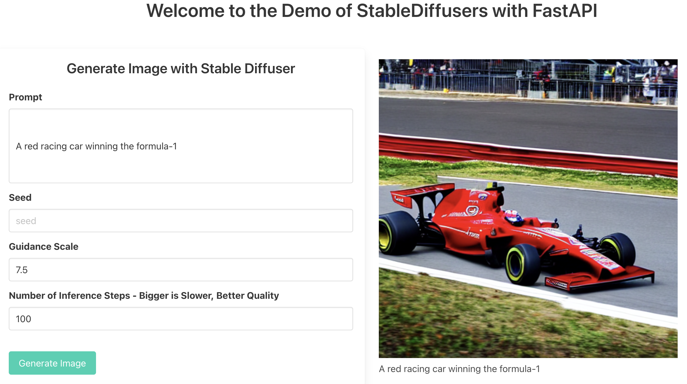

# Stable Diffusion Application using React with FastAPI

Author: [Laura Uzcategui](https://github.com/laurauzcategui)

Hello, I would like to share with you this small project that involves creating an Stable Diffusion App with React and FastAPI :grin:. 


Let's dive in by introducing what is the project about and why I have done it. 

## 1. What is this project about? 

On this project you can checkout how you can build an basic React Application using FastAPI as backend to be able to generate images with Stable Diffusion using the Diffusers library from Hugging Face.

## 2. Why I did built it?

For the past couple of months I've been hearing a lot about Stable Diffusion but I haven't had the time to explore it myself, then I saw an opportunity to get to know it but also do a refresh on my frontend skills which were a bit out-of-date by building a React App. 

Additionally, I wanted to learn more about FastAPI and this project is built on top of the webinar provided by the author of the library [Sebastian Ramirez](https://github.com/tiangolo). 

## 3. Concepts 

Before diving into the project, I'll give you an overview of the main concepts and technologies that have been used, and pointers to resources where you can learn more about it. 

### 3.1. What is Stable Diffusion?

[Stable Diffusion](https://stablediffusionweb.com/) is an AI technique comprised of a set of components to perform Image Generation from Text. What make it so great is that is available to everyone compared to other models such as Dall-e. 

In a short summary about Stable Diffusion, what happens is as follows: 

- You write a text that will be your prompt to generate the image you wish for. 
- This text is passed to the first component of the model a Text understander or Encoder, which generates token embedding vectors. 
- Then this representation is received by a [UNet](https://en.wikipedia.org/wiki/U-Net) along with a Tensor made up of noise and after a series of steps it will generate a Processed image tensor array. 
- The processed image tensor array is received then by an Image Decoder (Autoencoder decoder) that will generate the final image. 

#### 3.1.1 Resources 

- [Paper](https://openaccess.thecvf.com/content/CVPR2022/papers/Rombach_High-Resolution_Image_Synthesis_With_Latent_Diffusion_Models_CVPR_2022_paper.pdf) by Rombach, R., Blattmann, A., Lorenz, D., Esser, P., & Ommer, B. (2022). High-resolution image synthesis with latent diffusion models. In Proceedings of the IEEE/CVF Conference on Computer Vision and Pattern Recognition (pp. 10684-10695)
- [The Illustrated Stable Diffusion by Jay Alammar](https://jalammar.github.io/illustrated-stable-diffusion/)
- [How AI Image Generators Work (Stable Diffusion / Dall-E) - Youtube Video by Computerphile](https://youtu.be/1CIpzeNxIhU)

### 3.2 React as Front-end 

Perhaps you have heard already about React, so you can skip this section, if not as a short summary about React. 

[React](https://reactjs.org/) is a JavaScript library for building UI. It was created by Facebook (aka Meta) around 2013. 

As far as I could learn while working on this project, React works in declarative way, and one of the things that make it cool is that you can delcare components that has their own state and later on can be re-used across the application you are building. 

Coming from a purely backend experience I can say it wasn't super difficult to get and incorporate it to what I wanted to achieve which was to build a simple UI that will allow me to write text and wait for the backend to generate an image. 

#### 3.2.1 Resources
- [React Docs](https://reactjs.org/docs/getting-started.html)

### 3.3 FastAPI as backend

In here, things become more interesting to me when backend comes in and I discovered all you can do working with FastAPI. 

As their website state: 
> FastAPI is a modern, fast (high-performance), web framework for building APIs with Python 3.7+ based on standard Python type hints.

What I like from FastAPI is the ability to create API's quickly without too much hassle. I loved the fact I could define the routes and immediately check them out by looking at the API docs provided by Swaggeer. 

Additionally to this, you could define your data model as a Class by using pydantic inheriting from BaseModel. 

#### 3.3.1 Resources
- [FastAPI Docs](https://fastapi.tiangolo.com/)
- [FastAPI Tutorial - User Guide](https://fastapi.tiangolo.com/tutorial/)

## Project Structure

```
├── backend                          ----> Contains all the backend FastAPI work
│   ├── dev-requirements.txt
│   ├── main.py                      ----> Endpoints definition
│   ├── requirements.txt
│   ├── run_uvicorn.py
│   ├── schemas.py                   ----> Define your data models here
│   └── services.py                  ----> Define all the heavy load work to be done here.
|                                          in this case all the HuggingFace setup and work for generating the 
|                                          stable diffusion image
└── frontend
    ├── README.md
    ├── package-lock.json
    ├── package.json
    ├── public
    │   ├── index.html
    │   ├── manifest.json
    │   └── robots.txt
    └── src
        ├── App.jsx                 ---> Main App definition where you will embed your components as well
        ├── components
        │   ├── ErrorMessage.jsx
        │   ├── GenImage.jsx        ---> Definition of the UI components as well as the call to the backend 
                                         using fetch API
        │   └── Header.jsx          ---> Minimal Header definition
        └── index.js
```

## Setup and run it :) 

These are the steps to see it running :) 

### From your backend folder: 

1. You need a HugginFace token. Checkout how to create one [here](https://huggingface.co/docs/hub/security-tokens#how-to-manage-user-access-tokens)
2. Once you have your token created it follow the next steps

```
cd backend 
touch .env 
```

3. Open the .env file and add your token there like this: 

```
HF_TOKEN=MY_FANCY_TOKEN
```

**WARNING**: Make sure you never commit your keys or tokens file :) Add this file to your .gitignore

4. Create your environment and activate your environment
```
python -m venv venv 
source venv/bin/activate
pip install -r requirements.txt
```

5. Startup your backend 

```
uvicorn main:app --port 8885
```

### From your frontend folder

```
cd frontend
npm install 
npm start
```

## How to Generate an Image? 

Fill the parameters as follows:

- Prompt: Text to express the wish for your image. 

    `Example: A red racing car winning the formula-1` 
- Seed: a number indicating the seed so that your output will be deterministic. 
- Guidance scale: it's a float that basically try to enforce that the generation of the image better match the prompt. 

    > Side note: if you are curious about this parameter, you can do a deep dive by reading the paper [Classifier-free Diffusion Guidance](https://arxiv.org/pdf/2207.12598.pdf)
- Number of Inference Steps: It's a number usually between 50 and 100. This number indicates de amount of denoising steps. Keep in mind the higher the number the more time the inference ( image generation ) will take. 

You should be able to see your frontend like this one below: 

<p align="center">

</p>

## Resources I've used to build the project

- Webinar: [FastAPI for Machine Learning: Live coding an ML web application](https://www.youtube.com/watch?v=_BZGtifh_gw)
- FastAPI and ReactJS, a set of videos by [Rithmic - Youtube Channel](https://youtube.com/playlist?list=PLhH3UpV2flrwfJ2aSwn8MkCKz9VzO-1P4)
- [Stable Diffusion with 🧨 Diffusers by HuggingFace](https://huggingface.co/blog/stable_diffusion)

## ToDo

- Add endpoint that shows a grid of images instead of one
- Update the service backend with a new function to return multiple images. 
- Improve the UI by customizing Bulma with a different style. 
